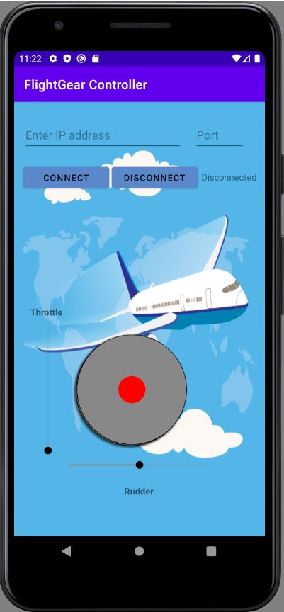
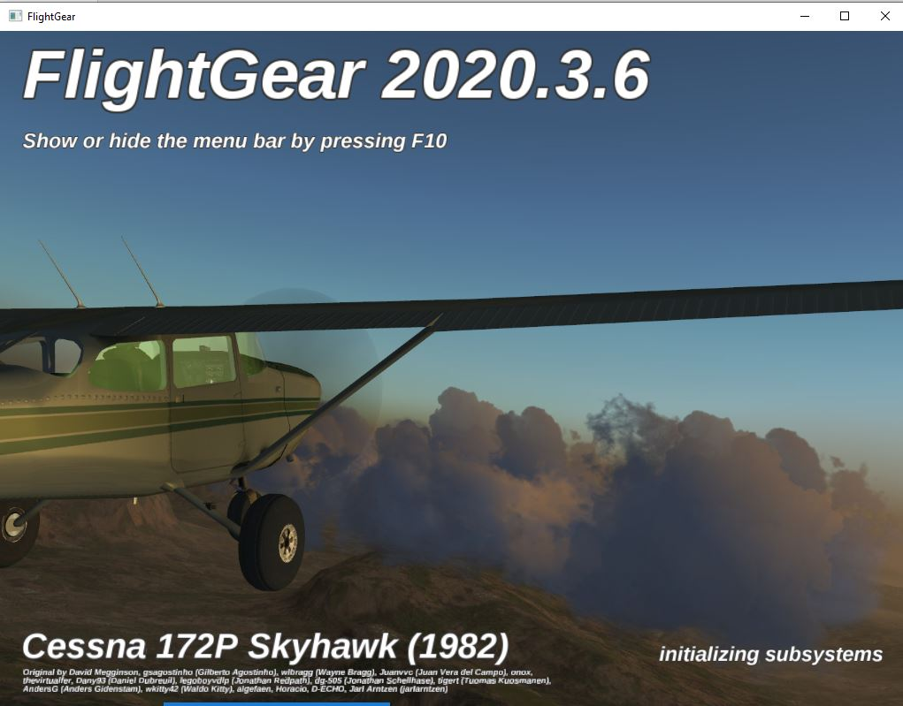
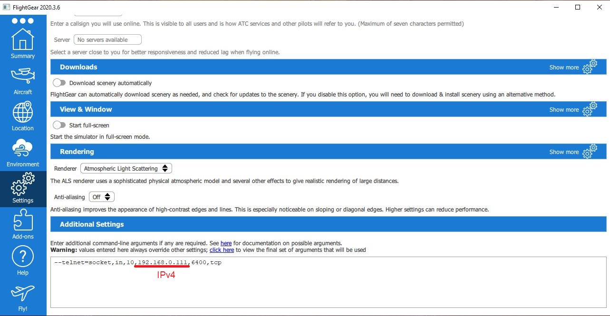

# FlightGear Simulator Android App
## Intro
This project is my implementation of an android application, which controlls remotely the FlightGear Simulator, based on MVVM architectural pattern.
As a participant in Advanced Programming course at the University of Bar Ilan.

 

## System Requirements
[FlightGear Simulator(2020.3.6 or above)](https://www.flightgear.org/download/)  
Min. version of Android 10 OS. (Tested ver. – Pixel 3a API 29)

## Installation Instructions
1. Install FlightGear.
2. Open FlightGear, open "settings" tab, on "Additional Settings" write: "--telnet=socket,in,10,192.168.0.111,6400,tcp". (Notice instead of writing 192.168.0.111, write down your IPv4 address. Make sure port 6400 is available, otherwise change it - see Image below).
3. Open Android Studio and start the application on your emulator (recommended - Pixel 3a API 29).
4. Start FlightGear Simulator.
5. Build and run the project from Android Studio.
6. Enter your IPv4 adrress and port(as mentioned in step 2).
7. Hit connect button. 
Enjoy your flight :)

Or simply download [APK file](https://github.com/yahavz100/JavaFlightGearAndroidApp/blob/master/InstallationAndPreview/FlightGearController.apk) and install on your device (On your own responsibility!).

Step 2 Image:

## Tools
1. IDE - Android Studio based on IntelliJ.
2. draw.io - UML creation.
3. FlightGear Simulator 2020.3.6.

## For more information 
[Youtube]() 
[Presentation](https://github.com/yahavz100/JavaFlightGearAndroidApp/blob/master/InstallationAndPreview/Advanced%20Programming%202%20-EX3.pptx)

